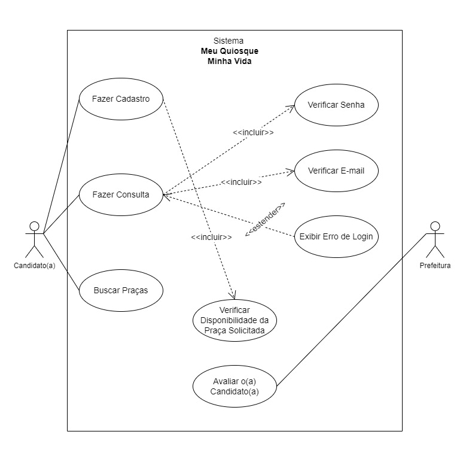
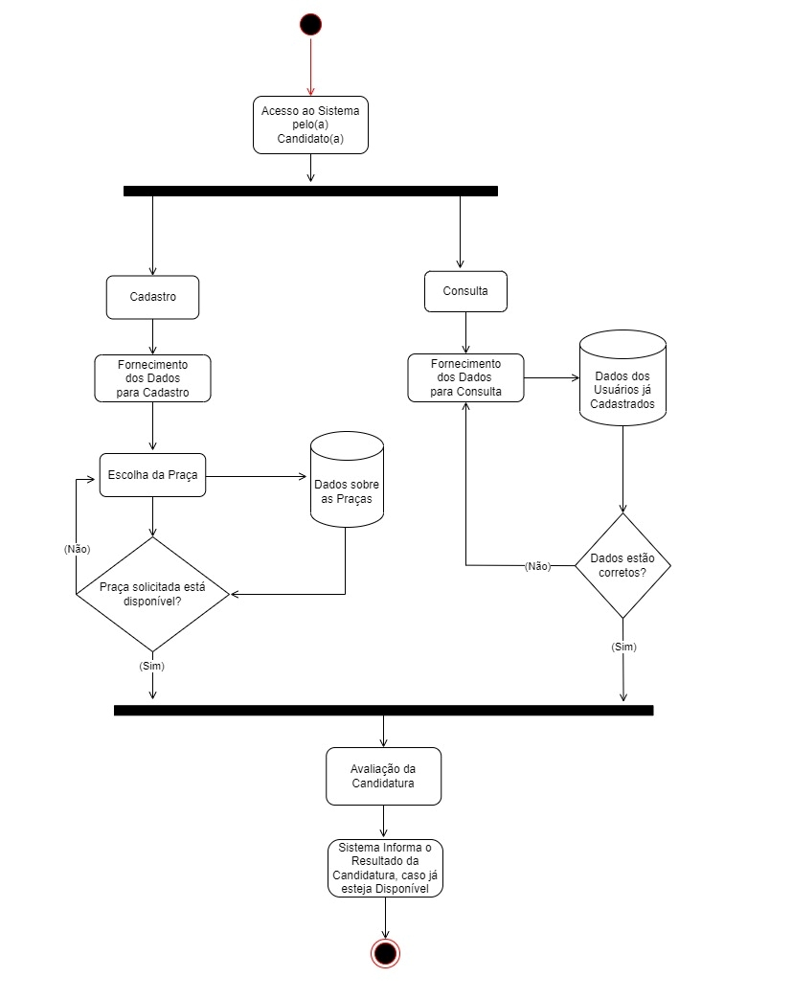

<h1 align="center">
    
</h1>

 <a href="#-sobre-o-projeto">Sobre</a> •
 <a href="#-planejamento">Planejamento</a> •
 <a href="#-orçamento">Orçamento</a> • 
 <a href="#-modelagem-uml">Modelagem</a> • 
 <a href="#-prototipo">Descrição do Protótipo</a> • 
 <a href="#-tecnologias-usadas">Tecnologias</a> • 
 <a href="#-deploy">Deploy</a> • 
 <a href="#-funcionalidades">Funcionalidades</a> • 
 <a href="#-equipe">Equipe</a> • 
 <a href="#-referencias">Referências</a>

## 💻 Sobre o projeto

Meu Quiosque Minha Vida - É uma aplicação que pretende encontrar soluções para aqueles que sofreram as consequências do fechamento dos comércios (lockdowns) e perderam seus empregos por terem as empresas que trabalham falidas ou por não poderem trabalhar, neste caso, para vendedores ambulantes e “informais”, vendedores de comida, entre outros.

O projeto consiste em uma aplicação WEB voltada para o cadastro destes trabalhadores em um sistema de oferta de vagas de Quiosques, esses Quiosques ficariam nas “praças mortas” de Sobral, ou seja, nas praças onde há menor interação de pessoas e que são desertas a qualquer hora do dia, fazendo com que essas áreas sejam revitalizadas. A prioridade em porcentagem dos cadastros seria:

- 60% Pessoas que sofreram diretamente com os lockdowns (demitidos/falidos e/ou vendedores informais/ambulantes).
- 20% Para pessoas de baixa renda que querem empreender.
- 20% Para empresários

## 💡 Planejamento

O planejamento do projeto foi feito principalmente através do uso do Whatsapp e também por meio de reuniões no meet, onde foram discutidas possíveis ideias para o projeto, foi feito um Brain Storm, onde foram apresentadas várias ideias e depois de uma breve discussão, foi decidido fazer um projeto com o objetivo de ajudar os comerciantes que tiveram sues comércios fechados em decorrência da pandemia, criando uma aplicação para o cadastro dos mesmos.

Foi usado também a ferramenta Kanban, que ajudou na organização do trabalho, tendo visibilidade de tudo o que ocorre na equipe e facilitando a visualização do que precisa ser feito, o que ainda está sendo feito e o que já foi feito.

## 💸 Orçamento 

A análise do orçamento foi feita levando em conta que a operação é feita totalmente de forma remota, sendo assim, dispensando gastos que envolvem estabelecimentos físicos, dessa forma, os gastos se resumem basicamente em mão de obra, onde o custo é calculado por hora. A parte de programação foi dividida entre 3 Programadores, dois de Front-End e outro de Back-End, além disso, foi contabilizado o custo de um Designer, que desenvolveu a interface gráfica do projeto. A tabela com os custos do projeto é mostrada a seguir:

| Profissional              | Valor/Hora      | Qtd/H | Total      |
|---------------------------|-----------------|-------|------------|
| Desenvolvimento Front-End |    R$300,00     |   20  | R$6.000,00 |
| Desenvolvimento Back-End  |    R$300,00     |   6   | R$1.800,00 |
| Designer                  |    R$300,00     |   2   |  R$600,00  |
|---------------------------|---------------- |-------|------------|
| Valor total               |                 |       | R$8.400,00 |

## 📚 Modelagem UML
A modelagem do sistema está apresentada pelos seguintes diagramas. 
O Diagrama de Caso de Uso é mostrado abaixo.

O Diagrama de Atividades é mostrado abaixo.

## 🖥️ Descrição do Protótipo
O protótipo implementado permite o cadastro de candidatos interessados em adquirir uma vaga em uma praça de Sobral (CE). Caso selecionado, o indivíduo poderá administrar um quiosque na praça que o sistema achar maior conformidade entre o interesse do solicitante e a disponibilidade da praça. 

A primeira página solicita informações básicas para a avaliação, relacionadas à identificação e localização do candidato. Na página seguinte, o candidato deve informar sua categoria e deve fazer upload no sistema de fotos de alguns documentos pedidos. Na terceira página, é questionada a área/setor de interesse do candidato e se ele possui alguma experiência nela. Por fim, é solicitada a praça de interesse e é deixado um campo para possíveis sugestões. Caso os passos descritos tenham sido efetuados corretamente, o sistema informa a conclusão do cadastro, que permitirá a avaliação e, posteriormente, a divulgação do resultado da solicitação. 

## 🛠 Tecnologias Usadas

As ferramentas usadas para a construção do projeto foram as seguintes:

- [Figma](https://figma.com/)
- [MySQL](https://www.mysql.com/)
- [JavaScript](https://www.javascript.com/)
- [Overleaf](https://pt.overleaf.com/)
- [Adobe Photoshop](https://www.adobe.com/br/products/photoshop.html/)
- [WonderShare Filmora](https://filmora.wondershare.net/pt-br/)
- [HTML5](https://dev.w3.org/html5/spec-LC/)
- [CSS3](https://www.w3.org/TR/2001/WD-css3-roadmap-20010523/)
- [draw.io](https://app.diagrams.net/)

## 📜 Deploy

O acesso à aplicação é feito por [aqui](https://levifrota.github.io/trabalho-eng-soft/)

## ⚙️ Funcionalidades

## 💪 Equipe

- Bryan Santos Sousa 338888
- Clezio Brigido de Oliveira 427778
- Daniel Alan Mesquita de Vasconcelos 422104
- Francisco Emerson Azevedo Sousa 415295
- Gideão Levi de Oliveira Frota 428557
- Thiago Marques Sousa 412645
- Vanessa Carvalho do Nascimento 471584

## 📝 Referências

- [ABRASEL - Associação Brasileira de Bares e Restaurantes](https://abrasel.com.br/)

